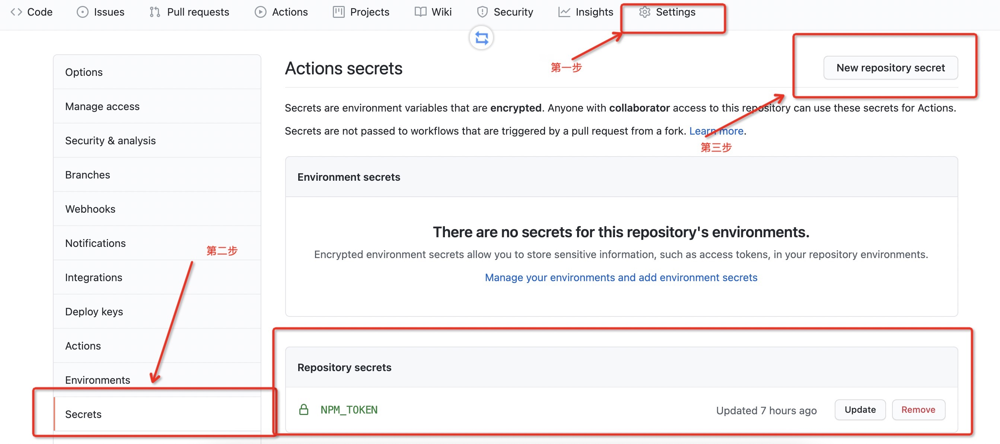
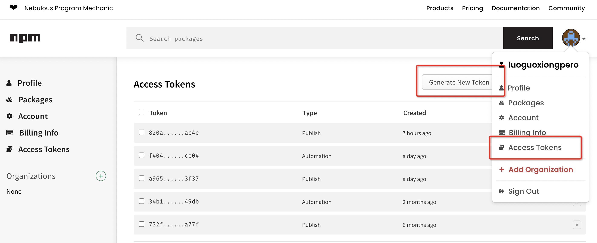

# Lerna Github CI  发布npm包


在折腾微前端落地和组件库方案的时候，用到了Lerna这个包管理工具。本文主要包含以下两个部分：

* 关于Lerna

* 如何使用 Github CI 自动npm包

## 一、关于Lerna

### 1. Lerna概念

Lerna 是一个管理工具，用于管理包含多个软件包（package）的 JavaScript 项目。

将大型代码仓库分割成多个独立版本化的 软件包（package）对于代码共享来说非常有用。但是，如果某些更改 跨越了多个代码仓库的话将变得很麻烦并且难以跟踪，并且， 跨越多个代码仓库的测试将迅速变得非常复杂。

为了解决这些（以及许多其它）问题，某些项目会将 代码仓库分割成多个软件包（package），并将每个软件包存放到独立的代码仓库中。但是，例如 Babel、 React、Angular、Ember、Meteor、Jest 等项目以及许多其他项目则是在 一个代码仓库中包含了多个软件包（package）并进行开发。

### 2. Lerna解决了哪些痛点

#### 资源浪费

通常情况下，一个公司的业务项目只有一个主干，多 `git repo` 的方式，这样 `node_module` 会出现大量的冗余，比如它们可能都会安装 `React`、`React-dom` 等包，浪费了大量存储空间。

#### 调试繁琐

很多公共的包通过 `npm` 安装，想要调试依赖的包时，需要通过 `npm link` 的方式进行调试。

#### 资源包升级问题

一个项目依赖了多个 `npm` 包，当某一个子 `npm` 包代码修改升级时，都要对主干项目包进行升级修改。(这个问题感觉是最烦的，可能一个版本号就要去更新一下代码并发布)

## 二、Github CI发布npm包

### 1.关于持续集成

持续集成 (CI) 是一种需要频繁提交代码到共享仓库的软件实践。 频繁提交代码能较早检测到错误，减少在查找错误来源时开发者需要调试的代码量。 频繁的代码更新也更便于从软件开发团队的不同成员合并更改。 这对开发者非常有益，他们可以将更多时间用于编写代码，而减少在调试错误或解决合并冲突上所花的时间。

提交代码到仓库时，可以持续创建并测试代码，以确保提交未引入错误。 您的测试可以包括代码语法检查（检查样式格式）、安全性检查、代码覆盖率、功能测试及其他自定义检查。

创建和测试代码需要服务器。 您可以在推送代码到仓库之前在本地创建并测试更新，也可以使用 CI 服务器检查仓库中的新代码提交。

### 2.发布npm包配置流程

* 新建一个github项目，然后再项目里的Setting配置Action secrets

  

* 去npm官网登录账户,在用户头像下有个Access Tokens选项，生成npmtoken



* 在项目内新建.github/workflows目录，新建一个npmpublish.yml

```yml
name: Create Release CI

# 触发gitAction时机
on:
  push:
    branches: [main]

jobs:
  version:
    runs-on: ubuntu-latest
# 任务流程
    steps:
      - uses: actions/checkout@v2
        with:
          fetch-depth: 0
      - run: git fetch --prune
      - name: Use Node.js 12
        uses: actions/setup-node@v1
        with:
          node-version: 12
          registry-url: https://registry.npmjs.org/
      - run: npm i
      - run: npm run lerna:publish
        env:
          NODE_AUTH_TOKEN: ${{secrets.NPM_TOKEN}}
```

### 项目地址：https://github.com/Peroluo/lerna-test

